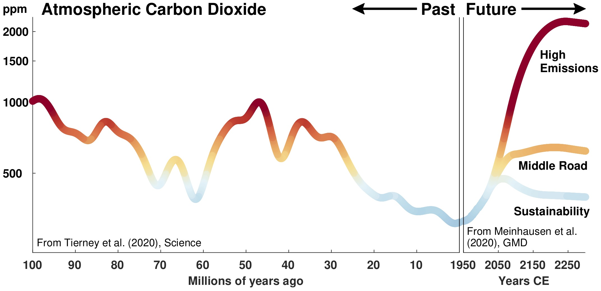

# PastClimates

This repository is a collection of useful data representing past climate changes. The data currently archived here are Supplements to the Review paper *Past climates inform our future*, published in 2020 in *Science*. When using these data, please cite our paper:

Tierney, J.E. et al (2020) Past climates inform our future, *Science* 370, eaay3701, <https://doi.org/10.1126/science.aay3701>

## Description of files

`co2Binned.csv`
This file contains binned estimates of past carbon dioxide levels based on multiple proxies (stomata, paleosols, algal lipids, boron isotopes). The bins are larger moving back in time, in accordance with data availability. The CO2 proxy data include the collection of Foster et al. (2017) *Nature Communications* <https://doi.org/10.1038/ncomms14845> as well as data published since then, including new boron (Sosdian et al., 2018 <https://doi.org/10.1016/j.epsl.2018.06.017>; Henehan et al., 2019 <https://doi.org/10.1073/pnas.1905989116>) and algal lipid (Super et al., 2018 <https://doi.org/10.1130/G40228.1>, Witkowski et al., 2018 <https://doi.org/10.1126/sciadv.aat4556>) data. For each time bin, available data and their accompanying 1-sigma lower and upper bounds were averaged together. Data with mean values below 150 ppm were excluded from the bin average on the basis that this level of CO2 is below the lowest values observed during the Late Pleistocene glaciations from the ice core record and is therefore not physically plausible (especially for warmer Mesozoic and Cenozoic climates).

`co2Smoothed.csv`
This file contains a resampled, smoothed version of the `co2Binned.csv`. The data in `co2Binned.csv` were resampled to 0.4 Ma timesteps and then smoothed with a Gaussian filter with a length of 8 Ma. These data are plotted in Figure 1 of *Past climates inform our future*.

`THansenMethod.csv`
This file contains a reconstruction of global mean annual surface temperature. Data from 65.5-0 Ma are taken directly from Hansen et al., (2013) <https://doi.org/10.1098/rsta.2012.0294>. The time series is then extended back to 114.5 Ma using the Mesozoic compilation of benthic &delta;18O of Friedrich et al., (2012) <https://doi.org/10.1130/G32701.1> and applying the same scaling method used by Hansen et al., (2013) for ice-free climates. Any &delta;18O data assigned to the same time interval were averaged prior to transformation to temperature.

`THansenMethodSmoothed.csv`
This file contains a resampled, smoothed version of `THansenMethod.csv`. Data were resampled to 0.2 Ma timesteps and then smoothed with a Gaussian filter with a length of 6 Ma. These data are plotted in Figure 1 of *Past climates inform our future*.

`RCPcGENIE.csv`
This file contains projected atmospheric CO2 values from 1750 AD to 500,000 years in the future under the IPCC AR5 Representative Concentration Pathways. Projections use the carbon-centric Grid Enabled Integrated Earth System Model (cGEnIE), an Earth System model of intermediate complexity. These data are plotted in Figure 4 of *Past climates inform our future*.
